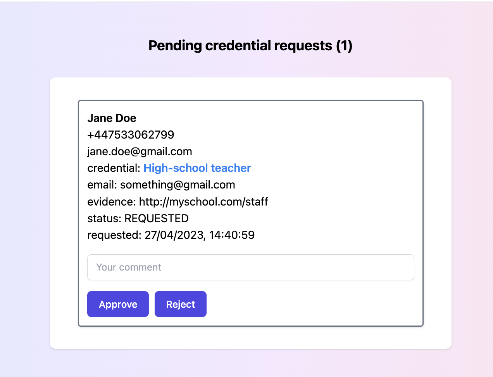

# Screenshots

## Sign up

## Home

## Home (small screens)

## Full argument

## Examples of AI outputs

- **Complexity** - look for sources of complexity in the last argument 
- **Completeness** - check that it answers all the points made by the previous author 
- **Ratings** - rate the argument (is it strong, concise, respectful and factual)
- **Strong words** - look for expressions or phrases which may be exaggerations
- **Platitudes** - look for expressions or phrases which are too vague or generic
- **Tone & Style** - how does the author "sound" (e.g. dismissive, aggressive, relax...) 
- **Add references** - suggest links and references to back up the claims made in the argument 
- **Congratulate Win** - prepare a message to congratulate the author for winning the round 
- **Loozer's Prize** - explain politely to the author that they didn't win this time 
- **Recap** - short summary of what different authors have argued so far 
- **Common Ground** - find some points of agreement between the last two authors 
- **Next direction** - propose 2-3 possible directions for the rest of the conversation 
- **Speaker face** - (just to play with DALL-E) guess what the author might looks like 
- **Next argument (Polite)** - what might the next contributor write as a response (in "polite" style) 
- **Next argument (Strong)** - what might the next contributor write as a response (in a "strong" style) 

## Submitting an argument

You'll need join one or both side of the conversation:

Then you'll see the arguments already submitted for the current round:

One can provide credentials if helpful (similarly to how people often share credentials on Quora, but the idea there would be to verify them)

## Credentials verification

Credentials are manually verified by admins from a hidden admin panel at the route `/verif`:

Users can see their credentials status from the account page:

## Reviewing other arguments

Open someone else's proposal:

After clicking on the flag button:

After clicking on the comments button:

Suggesting edits

You can see the diff after submitting edits:

Rating arguments

## Receiving feedback and notifications

You get notified when someone proposed an edit

The person who proposed an edit also gets notified when you decide to make changes based on their suggestion:

## Moderator panel to complete round

At the bottom of the conversation page, the moderator can see the list of arguments and decide which one to select as the winner of the round:

